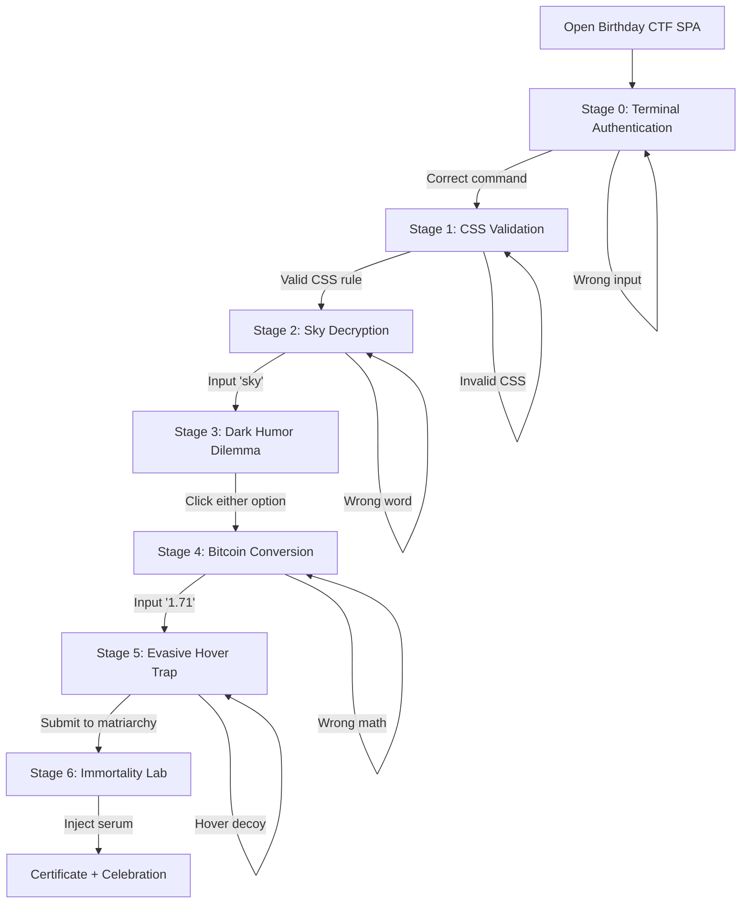

## 1. Product Overview
An immersive single-page birthday gift web app designed as a cinematic CTF journey for a backend developer friend.
- The product combines puzzle solving, dark terminal aesthetics, animated storytelling, and emotional payoff in one deployable React/Next.js experience.
- The value lies in turning shared memories, inside jokes, and developer culture into a polished interactive gift with strong replay and shareability.

## 2. Core Features

### 2.1 User Roles
| Role | Registration Method | Core Permissions |
|------|---------------------|------------------|
| Gift Recipient | No registration | Play all stages, solve challenges, unlock finale certificate |
| Gift Creator | No registration | Customize stage data, greeting copy, reward promise, visuals |

### 2.2 Feature Module
1. **Single Page Game Shell**: full-screen immersive layout, animated backgrounds, responsive overlays, stage-driven flow
2. **Stage 0 Auth Terminal**: exact command parsing, backend-style error output, boot sequence transition
3. **Stage 1 CSS Validation**: mini editor, regex-based validation, theme mutation to dark green
4. **Stage 2 Sky Decryption**: animated night sky, waveform visuals, exact string answer validation, simulated music reward
5. **Stage 3 Moral Dilemma**: dark humor choice cards, system log confirmation, stage unlock
6. **Stage 4 Crypto Conversion**: fixed BTC price dashboard, simulated ticker visuals, numeric validation
7. **Stage 5 Evasive Hover Trap**: mouse-avoiding decoy button, one valid progression path
8. **Stage 6 Immortality Finale**: code display, serum activation, confetti, certificate reveal, emotional birthday message
9. **Shared Progression Systems**: `currentStage` control, success effects, transition overlays, persistent local progress
10. **Atmospheric Design Layer**: cinematic gradients, motion effects, scanlines, neon highlights, rustic techno texture

### 2.3 Page Details
| Page Name | Module Name | Feature description |
|-----------|-------------|---------------------|
| Birthday CTF SPA | Global shell | Full viewport layout, stage switching, ambient overlays, navigation status, responsive scene framing |
| Birthday CTF SPA | Progress tracker | Displays current stage, solved count, challenge type, subtle route/journey feeling |
| Birthday CTF SPA | Stage 0 terminal | Accepts exact command `npm run start --token=526`; rejects other input with syntax or auth logs |
| Birthday CTF SPA | Stage 1 code editor | Uses `textarea` editor styling and regex validation for `.paper { color: green; }` or `.paper { color: #00ff00; }` |
| Birthday CTF SPA | Stage 2 decryption | Shows moving night sky, moon/cloud ambience, waveform placeholders, accepts only `sky` |
| Birthday CTF SPA | Stage 3 choice console | Renders two dark humor buttons; either click unlocks next stage and prints mock execution log |
| Birthday CTF SPA | Stage 4 market terminal | Displays fixed BTC price at 875 USD, ambient chart visuals, validates `1.71` |
| Birthday CTF SPA | Stage 5 trap interaction | Decoy button runs away on hover inside bounded area; valid button unlocks final stage |
| Birthday CTF SPA | Stage 6 lab finale | Shows infinite loop code, serum CTA, confetti burst, certificate card, promise of Malaysia trip |
| Birthday CTF SPA | Audio state feedback | Simulates boot sound, engine sound, storm trigger, market effects, finale celebration through UI state messaging |
| Birthday CTF SPA | Mobile adaptation | Preserves playability with stacked layouts, touch-safe actions, reduced decoy movement constraints |

## 3. Core Process
The user lands in a locked terminal and must solve each stage in sequence. Each successful answer advances the `currentStage` state, updates the atmosphere, and reveals the next themed challenge until the final certificate appears.

Key journey:
- Enter exact terminal authentication command
- Submit valid CSS rule
- Solve lyric word puzzle
- Choose either dark humor dilemma action
- Enter the BTC division result
- Click the only stable matriarchy submission action
- Inject the serum and reveal the birthday certificate

## 4. User Interface Design
### 4.1 Design Style
- Primary colors: matte black, charcoal, oil green, toxic emerald, muted gold, deep crimson accents
- Secondary accents: neon green for system success, magenta for conflict, cyan for technical highlights
- Button style: beveled cinematic panels with glow borders, distressed textures, hover bloom, and subtle scanline overlays
- Typography: industrial display font for titles, monospace terminal font for system text, readable sans font for supporting copy
- Layout style: desktop-first full-screen stage compositions with central interaction panels and atmospheric side ornaments
- Icon style suggestions: minimal technical glyphs, grid marks, console prompts, wireframe route markers
- Treasure map directive: the main shell should visually resemble a hand-drawn parchment adventure map, and the walking route marker should be a named character called `Bakri` using the image asset `public/bakri.jpg`

### 4.2 Page Design Overview
| Page Name | Module Name | UI Elements |
|-----------|-------------|-------------|
| Birthday CTF SPA | Global shell | Layered gradient sky, noise texture, vignettes, cinematic shadow framing, subtle map/grid ornaments |
| Birthday CTF SPA | Header/status band | Stage name, coordinates when available, progress markers, system activity labels |
| Birthday CTF SPA | Terminal scene | Retro prompt lines, blinking caret, boot logs, green phosphor glow, opaque black panel |
| Birthday CTF SPA | Code scene | Distressed parchment card, code gutter effect, syntax-inspired textarea, green theme mutation on success |
| Birthday CTF SPA | Sky scene | Animated moon, drifting clouds, waveform bars, glow pulses, lightning flash on success |
| Birthday CTF SPA | Ocean scene | Abyssal radial gradients, warning rings, floating action cards, cold blue highlights |
| Birthday CTF SPA | Market scene | Faux candlestick chart, data badges, numeric HUD, ticker ribbons, glitch panels |
| Birthday CTF SPA | Citadel scene | Dense jungle fog, gate silhouette, unstable decoy button motion, strong pink-vs-green contrast |
| Birthday CTF SPA | Lab finale | Golden reactor glow, code rain, bubbling chamber, confetti particles, decorative certificate |

### 4.3 Responsiveness
- Desktop-first responsive design with cinematic layouts for large screens and stacked interaction cards for tablet/mobile
- Stage panels maintain readable widths with `max-width` constraints and viewport-relative spacing
- Hover-dependent interactions receive touch-safe fallbacks on small screens
- Decorative backgrounds gracefully reduce complexity on low-width devices while preserving atmosphere

### 4.4 Motion and Visual Effects Guidance
- Use Tailwind keyframes or CSS animations for cloud drift, waveform pulsing, chart shimmer, scanlines, and status blink
- Use staged reveal animations when entering a new challenge to create narrative pacing
- Confetti and celebration should be high-impact but brief to protect performance
- Audio-related effects should degrade gracefully if real media is unavailable by using UI state indicators
- Background layers should rely on gradients, shadows, and CSS effects instead of heavy media files where possible
- The shell should feature a parchment map panel with dotted navigation lines and a moving `Bakri` marker to better match the gift reference art
