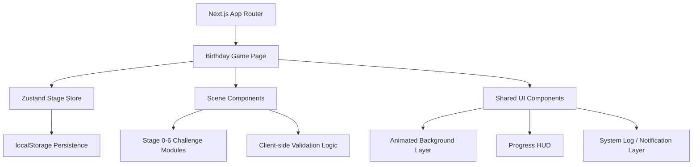
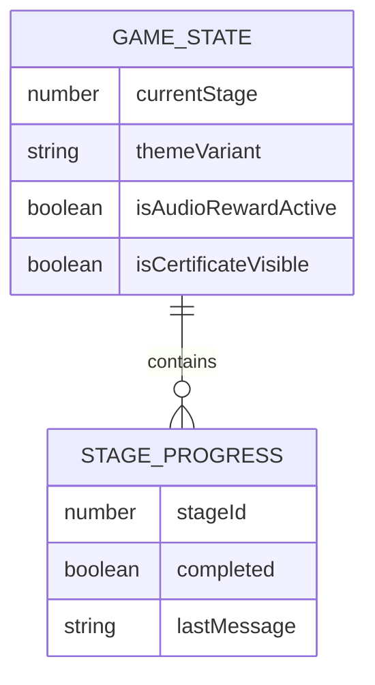

## 1. Architecture Design


## 2. Technology Description
- Framework: Next.js 15 + React 19 + TypeScript
- Styling: Tailwind CSS 4 + custom CSS variables + keyframe animations in global stylesheet
- State management: Zustand for `currentStage`, stage completion, transient success effects, audio simulation flags, and finale state
- Animation: CSS/Tailwind animations with optional lightweight confetti library or custom particle effect
- Icons: `lucide-react`
- Persistence: browser `localStorage` for resumable progress after refresh
- Deployment target: Vercel-compatible static/dynamic Next.js frontend

## 3. Route Definitions
| Route | Purpose |
|-------|---------|
| / | Hosts the full birthday CTF single-page application |

## 4. API Definitions
No backend API is required for the initial release.

All challenge validation executes on the client side using controlled inputs and deterministic checks:

```ts
type StageId = 0 | 1 | 2 | 3 | 4 | 5 | 6;

type StageStore = {
  currentStage: StageId;
  completedStages: StageId[];
  themeVariant: "terminal" | "forest-green" | "storm" | "abyss" | "market" | "citadel" | "lab";
  isAudioRewardActive: boolean;
  isCertificateVisible: boolean;
  stageLogs: string[];
  terminalCommand: string;
  updateTerminalCommand: (value: string) => void;
  submitStage0: () => boolean;
  submitStage1: (value: string) => boolean;
  submitStage2: (value: string) => boolean;
  submitStage3: (optionId: string) => boolean;
  submitStage4: (value: string) => boolean;
  advanceStage: () => void;
  triggerFinale: () => void;
  resetGame: () => void;
};
```

## 5. Component Architecture
| Component | Responsibility |
|-----------|----------------|
| `app/page.tsx` | Page composition and bootstrapping of the SPA |
| `src/components/game/BirthdayCtfApp.tsx` | Main scene controller and stage rendering |
| `src/components/game/StageShell.tsx` | Shared cinematic frame, title band, progress HUD, and transition wrapper |
| `src/components/game/TreasureMap.tsx` | Parchment-style navigation map with dotted route and `Bakri` image marker |
| `src/components/game/StageProgress.tsx` | Progress indicator for stages 0-6 |
| `src/components/game/SystemLog.tsx` | Animated system messages, success logs, and challenge hints |
| `src/components/game/backgrounds/*` | Reusable atmospheric background layers per stage |
| `src/components/game/stages/Stage0Terminal.tsx` | Terminal authentication logic and UI |
| `src/components/game/stages/Stage1CssEditor.tsx` | CSS textarea validation scene |
| `src/components/game/stages/Stage2SkyDecrypt.tsx` | Lyric decryption scene and simulated audio reward |
| `src/components/game/stages/Stage3Dilemma.tsx` | Choice buttons and execution log |
| `src/components/game/stages/Stage4BtcMath.tsx` | BTC dashboard and numeric validation |
| `src/components/game/stages/Stage5HoverTrap.tsx` | Evasive button interaction and valid action path |
| `src/components/game/stages/Stage6ImmortalityLab.tsx` | Serum injection, confetti, and certificate reveal |
| `src/hooks/usePersistedBirthdayGame.ts` | Local storage hydration and persistence sync |
| `src/store/useBirthdayGameStore.ts` | Zustand store for all stage and theme state |
| `src/utils/validators.ts` | Regex and exact-match validators |
| `src/utils/stage-data.ts` | Static stage configuration constants |

## 6. Data Model
### 6.1 Data Model Definition


### 6.2 Client-side Data Definition
```ts
export type StageConfig = {
  stage: StageId;
  name: string;
  challengeType: string;
  coordinates: { lat: number; lng: number } | null;
  mechanics: string;
  onSuccessEffect: string;
  correctCommand?: string;
  correctAnswerRegex?: string;
  correctInput?: string;
  correctAnswer?: string;
  targetAction?: string;
  actionButtonText?: string;
  codeTemplate?: string;
  options?: Array<{
    id: string;
    text: string;
    isProceed: boolean;
  }>;
};
```

## 7. State and Interaction Rules
- Initialize `currentStage` as `0`
- Render only one active challenge scene at a time
- Allow progression only after the active stage validates successfully
- Record short system logs after every submit attempt for feedback
- Update theme tokens and background layer according to the active stage
- Persist `currentStage`, solved stages, and finale reveal state in `localStorage`
- Expose a `resetGame` action for replay without page reload

## 8. Validation Rules
- Stage 0 accepts only the exact string `npm run start --token=526`
- Stage 1 validates against the provided regex and trims surrounding whitespace
- Stage 2 accepts only `sky` in a case-insensitive trimmed comparison, then normalizes to exact success
- Stage 3 advances on either listed option button
- Stage 4 accepts only `1.71`
- Stage 5 ignores the evasive decoy as a valid path; only the stable button advances
- Stage 6 reveals the certificate only after the serum action fires

## 9. Visual System
- Use CSS variables for background, panel, border, glow, accent, danger, and text colors
- Keep a monochrome dark base with one or two active accent hues per stage
- Apply layered gradients, blur glows, scanlines, and texture overlays to avoid flatness
- Use a monospace font for system text and a cinematic display font for headings
- Constrain interaction cards to readable widths while backgrounds remain expansive
- The stage shell should include a parchment treasure map reference panel and place `public/bakri.jpg` as the active route traveler named `Bakri`

## 10. Testing Strategy
- Add component-level tests for validators and key interaction flows
- Verify exact success and failure paths for stages 0, 1, 2, and 4
- Verify stage progression order and that later stages do not unlock prematurely
- Verify the Stage 5 decoy changes coordinates on hover
- Run `npm run check` after implementation
- Launch the local dev server and verify the full stage flow in the browser
